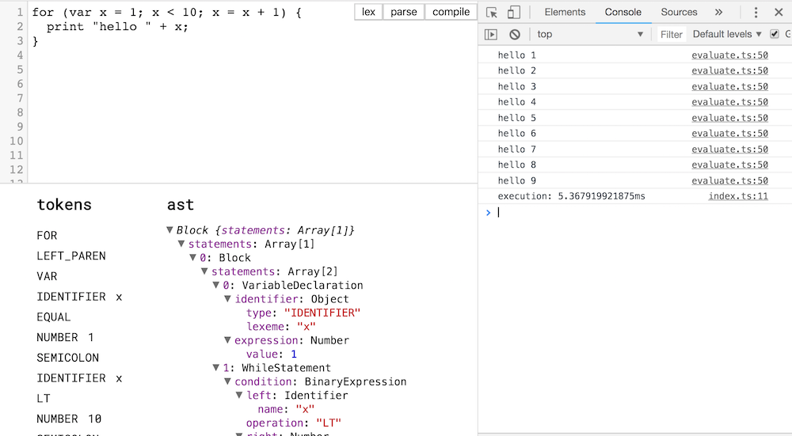

# lox compiler 🍣

A typescript / react web app implentation of a lexer / parser / tree-walk
interpreter for the lox language, as described in [Crafting
Interpreters](http://craftinginterpreters.com/). Written as part of the work for
the languages and compilers course at [Bradfield School of Computer
Science](https://bradfieldcs.com/).



## Get started

```bash
yarn                # install dependencies
yarn start          # run the app
```

## Progress

- [x] Expressions
- [x] Print Statements
- [x] Variable Declarations
- [x] Block Scoping
- [x] If / Then / Else
- [x] While / For Loops
- [ ] Functions
- [ ] Classes
- [ ] Bytecode VM

<hr />

This project was bootstrapped with [Create React App](https://github.com/facebookincubator/create-react-app).
